# German Traffic Sign Classification Using TensorFlow
**In this project, I used Python and TensorFlow to classify traffic signs.**

**Dataset used: [German Traffic Sign Dataset](http://benchmark.ini.rub.de/?section=gtsrb&subsection=dataset).
This dataset has more than 50,000 images of 43 classes.**

**I was able to reach a +99% validation accuracy, and a 97.6% testing accuracy.**

## Pipeline architecture:
- **Load The Data.**
- **Dataset Summary & Exploration**
- **Data Preprocessing**.
    - Shuffling.
    - Grayscaling.
    - Local Histogram Equalization.
    - Normalization.
- **Design a Model Architecture.**
    - LeNet-5.
    - VGGNet.
- **Model Training and Evaluation.**
- **Testing the Model Using the Test Set.**
- **Testing the Model on New Images.**

I'll explain each step in details below.

#### Environement:
-  Ubuntu 16.04
-  Anaconda 5.0.1
-  Python 3.6.2
-  TensorFlow 0.12.1 (GPU support)

---
## Step 1: Load The Data

Download the dataset from [here](https://d17h27t6h515a5.cloudfront.net/topher/2017/February/5898cd6f_traffic-signs-data/traffic-signs-data.zip). This is a pickled dataset in which we've already resized the images to 32x32.

We already have three `.p` files of 32x32 resized images:
- `train.p`: The training set.
- `test.p`: The testing set.
- `valid.p`: The validation set.

We will use Python `pickle` to load the data.

---

## Step 2: Dataset Summary & Exploration

The pickled data is a dictionary with 4 key/value pairs:

- `'features'` is a 4D array containing raw pixel data of the traffic sign images, (num examples, width, height, channels).
- `'labels'` is a 1D array containing the label/class id of the traffic sign. The file `signnames.csv` contains id -> name mappings for each id.
- `'sizes'` is a list containing tuples, (width, height) representing the original width and height the image.
- `'coords'` is a list containing tuples, (x1, y1, x2, y2) representing coordinates of a bounding box around the sign in the image.

**First, we will use `numpy` provide the number of images in each subset, in addition to the image size, and the number of unique classes.**
Number of training examples:  34799
Number of testing examples:  12630
Number of validation examples:  4410
Image data shape = (32, 32, 3)
Number of classes = 43

**Then, we used `matplotlib` plot sample images from each subset.**


<figure>
 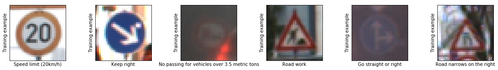
 <figcaption>
 <p></p> 
 </figcaption>
</figure>


<figure>
 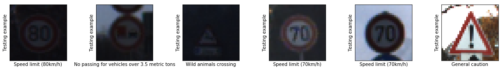
 <figcaption>
 <p></p> 
 </figcaption>
</figure>

<figure>
 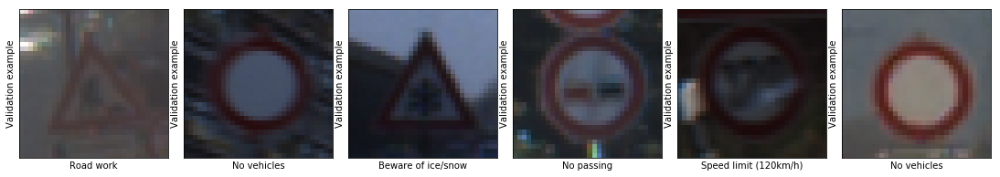
 <figcaption>
 <p></p> 
 </figcaption>
</figure>


**And finally, we will use `numpy` to plot a histogram of the count of images in each unique class.**


<figure>
 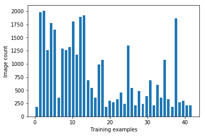
 <figcaption>
 <p></p> 
 </figcaption>
</figure>

<figure>
 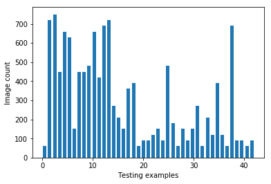
 <figcaption>
 <p></p> 
 </figcaption>
</figure>

<figure>
 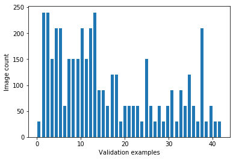
 <figcaption>
 <p></p> 
 </figcaption>
</figure>

---

## Step 3: Data Preprocessing

In this step, we will apply several preprocessing steps to the input images to achieve the best possible results.

**We will use the following preprocessing techniques:**
1. Shuffling.
2. Grayscaling.
3. Local Histogram Equalization.
4. Normalization.

1. **Shuffling**: In general, we shuffle the training data to increase randomness and variety in training dataset, in order for the model to be more stable. We will use `sklearn` to shuffle our data.

2. **Grayscaling**: In their paper ["Traffic Sign Recognition with Multi-Scale Convolutional Networks"](http://yann.lecun.com/exdb/publis/pdf/sermanet-ijcnn-11.pdf) published in 2011, P. Sermanet and Y. LeCun stated that using grayscale images instead of color improves the ConvNet's accuracy. We will use `OpenCV` to convert the training images into grey scale.

<figure>
 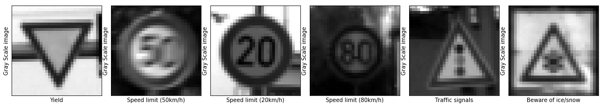
 <figcaption>
 <p></p> 
 </figcaption>
</figure>

3. **Local Histogram Equalization**: This technique simply spreads out the most frequent intensity values in an image, resulting in enhancing images with low contrast. Applying this technique will be very helpfull in our case since the dataset in hand has real world images, and many of them has low contrast. We will use `skimage` to apply local histogram equalization to the training images.

<figure>
 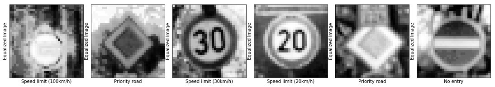
 <figcaption>
 <p></p> 
 </figcaption>
</figure>

4. **Normalization**: Normalization is a process that changes the range of pixel intensity values. Usually the image data should be normalized so that the data has mean zero and equal variance.

<figure>
 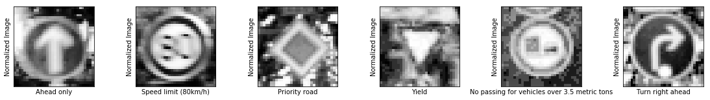
 <figcaption>
 <p></p> 
 </figcaption>
</figure>

---

## Step 3: Design a Model Architecture

In this step, we will design and implement a deep learning model that learns to recognize traffic signs from our dataset [German Traffic Sign Dataset](http://benchmark.ini.rub.de/?section=gtsrb&subsection=dataset).

We'll use Convolutional Neural Networks to classify the images in this dataset. The reason behind choosing ConvNets is that they are designed to recognize visual patterns directly from pixel images with minimal preprocessing. They automatically learn hierarchies of invariant features at every level from data.
We will implement two of the most famous ConvNets. Our goal is to reach an accuracy of +95% on the validation set.

I'll start by explaining each network architecture, then implement it using TensorFlow.

**Notes**:
1. We specify the learning rate of 0.001, which tells the network how quickly to update the weights.
2. We minimize the loss function using the Adaptive Moment Estimation (Adam) Algorithm. Adam is an optimization algorithm introduced by D. Kingma and J. Lei Ba in a 2015 paper named [Adam: A Method for Stochastic Optimization](https://arxiv.org/abs/1412.6980). Adam algorithm computes adaptive learning rates for each parameter. In addition to storing an exponentially decaying average of past squared gradients like [Adadelta](https://arxiv.org/pdf/1212.5701.pdf) and [RMSprop](https://www.cs.toronto.edu/~tijmen/csc321/slides/lecture_slides_lec6.pdf) algorithms, Adam also keeps an exponentially decaying average of past gradients mtmt, similar to [momentum algorithm](http://www.sciencedirect.com/science/article/pii/S0893608098001166?via%3Dihub), which in turn produce better results.
3. we will run `minimize()` function on the optimizer which use backprobagation to update the network and minimize our training loss.


### 1.  LeNet-5
LeNet-5 is a convolutional network designed for handwritten and machine-printed character recognition. It was introduced by the famous [Yann LeCun](https://en.wikipedia.org/wiki/Yann_LeCun) in his paper [Gradient-Based Learning Applied to Document Recognition](http://yann.lecun.com/exdb/publis/pdf/lecun-01a.pdf) in 1998. Although this ConvNet is intended to classify hand-written digits, we're confident it have a very high accuracy when dealing with traffic signs, given that both hand-written digits and traffic signs are given to the computer in the form of pixel images.

**LeNet-5 architecture:**
<figure>
 
 <figcaption>
 <p></p> 
 </figcaption>
</figure>

This ConvNet follows these steps:

Input => Convolution => ReLU => Pooling => Convolution => ReLU => Pooling => FullyConnected => ReLU => FullyConnected

**Layer 1 (Convolutional):** The output shape should be 28x28x6.

**Activation.** Your choice of activation function.

**Pooling.** The output shape should be 14x14x6.

**Layer 2 (Convolutional):** The output shape should be 10x10x16.

**Activation.** Your choice of activation function.

**Pooling.** The output shape should be 5x5x16.

**Flattening:** Flatten the output shape of the final pooling layer such that it's 1D instead of 3D.

**Layer 3 (Fully Connected):** This should have 120 outputs.

**Activation.** Your choice of activation function.

**Layer 4 (Fully Connected):** This should have 84 outputs.

**Activation.** Your choice of activation function.

**Layer 5 (Fully Connected):** This should have 10 outputs.

### 2.  VGGNet
VGGNet was first introduced in 2014 by K. Simonyan and A. Zisserman from the University of Oxford in a paper called [Very Deep Convolutional Networks for Large-Scale Image Recognition](https://arxiv.org/pdf/1409.1556.pdf). They were investigating the convolutional network depth on its accuracy in the large-scale image recognition setting. Their main contribution is a thorough evaluation of networks of increasing depth using an architecture with very small (3x3) convolution filters, which shows that a significant improvement on the prior-art configurations can be achieved by pushing the depth to 16-19 weight layers.

**VGGNet architecture:**
<figure>
 
 <figcaption>
 <p></p> 
 </figcaption>
</figure>

The original VGGNet architecture has 16-19 layers, but I've excluded some of them and implemented a modified version of only 12 layers to save computational resources.

This ConvNet follows these steps:

Input => Convolution => ReLU => Convolution => ReLU => Pooling => Convolution => ReLU => Convolution => ReLU => Pooling => Convolution => ReLU => Convolution => ReLU => Pooling => FullyConnected => ReLU => FullyConnected => ReLU => FullyConnected

**Layer 1 (Convolutional):** The output shape should be 32x32x32.

**Activation.** Your choice of activation function.

**Layer 2 (Convolutional):** The output shape should be 32x32x32.

**Activation.** Your choice of activation function.

**Layer 3 (Pooling)** The output shape should be 16x16x32.

**Layer 4 (Convolutional):** The output shape should be 16x16x64.

**Activation.** Your choice of activation function.

**Layer 5 (Convolutional):** The output shape should be 16x16x64.

**Activation.** Your choice of activation function.

**Layer 6 (Pooling)** The output shape should be 8x8x64.

**Layer 7 (Convolutional):** The output shape should be 8x8x128.

**Activation.** Your choice of activation function.

**Layer 8 (Convolutional):** The output shape should be 8x8x128.

**Activation.** Your choice of activation function.

**Layer 9 (Pooling)** The output shape should be 4x4x128.

**Flattening:** Flatten the output shape of the final pooling layer such that it's 1D instead of 3D.

**Layer 10 (Fully Connected):** This should have 128 outputs.

**Activation.** Your choice of activation function.

**Layer 11 (Fully Connected):** This should have 128 outputs.

**Activation.** Your choice of activation function.

**Layer 12 (Fully Connected):** This should have 43 outputs.

---

## Step 4: Model Training and Evaluation

In this step, we will train our model using `normalized_images`, then we'll compute softmax cross entropy between `logits` and `labels` to measure the model's error probability.

The `keep_prob` and `keep_prob_conv` variables will be used to control the dropout rate when training the neural network.
Overfitting is a serious problem in deep nural networks. Dropout is a technique for addressing this problem.
The key idea is to randomly drop units (along with their connections) from the neural network during training. This prevents units from co-adapting too much. During training, dropout samples from an exponential number of different “thinned” networks. At test time, it is easy to approximate the effect of averaging the predictions of all these thinned networks by simply using a single unthinned network that has smaller weights. This significantly reduces overfitting and gives major improvements over other regularization methods. This technique was introduced by N. Srivastava, G. Hinton, A. Krizhevsky I. Sutskever, and R. Salakhutdinov in their paper [Dropout: A Simple Way to Prevent Neural Networks from Overfitting](https://www.cs.toronto.edu/~hinton/absps/JMLRdropout.pdf).

Now, we'll run the training data through the training pipeline to train the model.
- Before each epoch, we'll shuffle the training set.
- After each epoch, we measure the loss and accuracy of the validation set.
- And after training, we will save the model.
- A low accuracy on the training and validation sets imply underfitting. A high accuracy on the training set but low accuracy on the validation set implies overfitting.

### LeNet Model
```
EPOCH 1 : Validation Accuracy = 81.451%
EPOCH 2 : Validation Accuracy = 87.755%
EPOCH 3 : Validation Accuracy = 90.113%
EPOCH 4 : Validation Accuracy = 91.519%
EPOCH 5 : Validation Accuracy = 90.658%
EPOCH 6 : Validation Accuracy = 92.608%
EPOCH 7 : Validation Accuracy = 92.902%
EPOCH 8 : Validation Accuracy = 92.585%
EPOCH 9 : Validation Accuracy = 92.993%
EPOCH 10 : Validation Accuracy = 92.766%
EPOCH 11 : Validation Accuracy = 93.356%
EPOCH 12 : Validation Accuracy = 93.469%
EPOCH 13 : Validation Accuracy = 93.832%
EPOCH 14 : Validation Accuracy = 94.603%
EPOCH 15 : Validation Accuracy = 93.333%
EPOCH 16 : Validation Accuracy = 93.787%
EPOCH 17 : Validation Accuracy = 94.263%
EPOCH 18 : Validation Accuracy = 92.857%
EPOCH 19 : Validation Accuracy = 93.832%
EPOCH 20 : Validation Accuracy = 93.605%
EPOCH 21 : Validation Accuracy = 93.447%
EPOCH 22 : Validation Accuracy = 94.286%
EPOCH 23 : Validation Accuracy = 94.671%
EPOCH 24 : Validation Accuracy = 94.172%
EPOCH 25 : Validation Accuracy = 94.399%
EPOCH 26 : Validation Accuracy = 95.057%
EPOCH 27 : Validation Accuracy = 95.329%
EPOCH 28 : Validation Accuracy = 94.218%
EPOCH 29 : Validation Accuracy = 94.286%
EPOCH 30 : Validation Accuracy = 94.853%
```
We've been able to reach a maximum accuracy of **95.3%** on the validation set over 30 epochs, using a learning rate of 0.001.

Now, we'll train the VGGNet model and evaluate it's accuracy.

### VGGNet Model
```
EPOCH 1 : Validation Accuracy = 31.655%
EPOCH 2 : Validation Accuracy = 59.592%
EPOCH 3 : Validation Accuracy = 78.639%
EPOCH 4 : Validation Accuracy = 88.617%
EPOCH 5 : Validation Accuracy = 92.812%
EPOCH 6 : Validation Accuracy = 95.601%
EPOCH 7 : Validation Accuracy = 96.667%
EPOCH 8 : Validation Accuracy = 97.528%
EPOCH 9 : Validation Accuracy = 98.390%
EPOCH 10 : Validation Accuracy = 98.322%
EPOCH 11 : Validation Accuracy = 98.776%
EPOCH 12 : Validation Accuracy = 98.730%
EPOCH 13 : Validation Accuracy = 98.617%
EPOCH 14 : Validation Accuracy = 98.571%
EPOCH 15 : Validation Accuracy = 99.025%
EPOCH 16 : Validation Accuracy = 99.116%
EPOCH 17 : Validation Accuracy = 98.776%
EPOCH 18 : Validation Accuracy = 98.707%
EPOCH 19 : Validation Accuracy = 98.526%
EPOCH 20 : Validation Accuracy = 98.685%
EPOCH 21 : Validation Accuracy = 99.297%
EPOCH 22 : Validation Accuracy = 99.320%
EPOCH 23 : Validation Accuracy = 99.297%
EPOCH 24 : Validation Accuracy = 99.161%
EPOCH 25 : Validation Accuracy = 98.798%
EPOCH 26 : Validation Accuracy = 98.707%
EPOCH 27 : Validation Accuracy = 99.048%
EPOCH 28 : Validation Accuracy = 99.116%
EPOCH 29 : Validation Accuracy = 98.458%
EPOCH 30 : Validation Accuracy = 99.161%
```

Using VGGNet, we've been able to reach a maximum **validation accuracy of 99.3%**. As you can observe, the model has nearly saturated after only 10 epochs, so we can reduce the epochs to 10 and save computational resources.

We'll use this model to predict the labels of the test set.


---

## Step 5: Testing the Model using the Test Set

Now, we'll use the testing set to measure the accuracy of the model over unknown examples.
We've been able to reach a **Test accuracy of 97.6%**. A remarkable performance.

Now we'll plot the confusion matrix to see where the model actually fails.

<figure>
 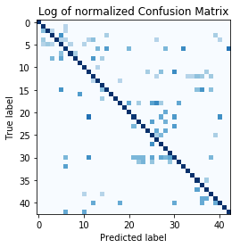
 <figcaption>
 <p></p> 
 </figcaption>
</figure>

We observe some clusters in the confusion matrix above. It turns out that the various speed limits are sometimes misclassified among themselves. Similarly, traffic signs with traingular shape are misclassified among themselves. We can further improve on the model using hierarchical CNNs to first identify broader groups (like speed signs) and then have CNNs to classify finer features (such as the actual speed limit).

---

## Step 6: Testing the Model on New Images

In this step, we will use the model to predict traffic signs type of 5 random images of German traffic signs from the web our model's performance on these images.
Number of new testing examples:  5

<figure>
 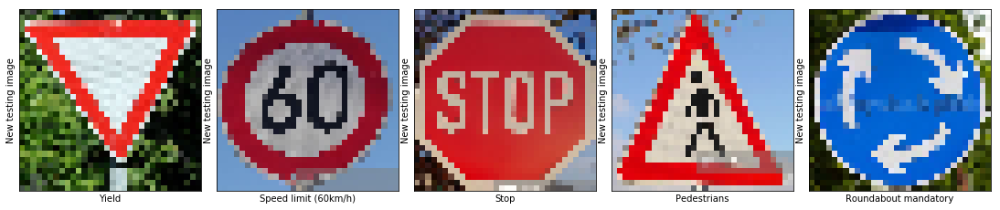
 <figcaption>
 <p></p> 
 </figcaption>
</figure>

These test images include some easy to predict signs, and other signs are considered hard for the model to predict.

For instance, we have easy to predict signs like the "Stop" and the "No entry". The two signs are clear and belong to classes where the model can predict with  high accuracy.

On the other hand, we have signs belong to classes where has poor accuracy, like the "Speed limit" sign, because as stated above it turns out that the various speed limits are sometimes misclassified among themselves, and the "Pedestrians" sign, because traffic signs with traingular shape are misclassified among themselves.

<figure>
 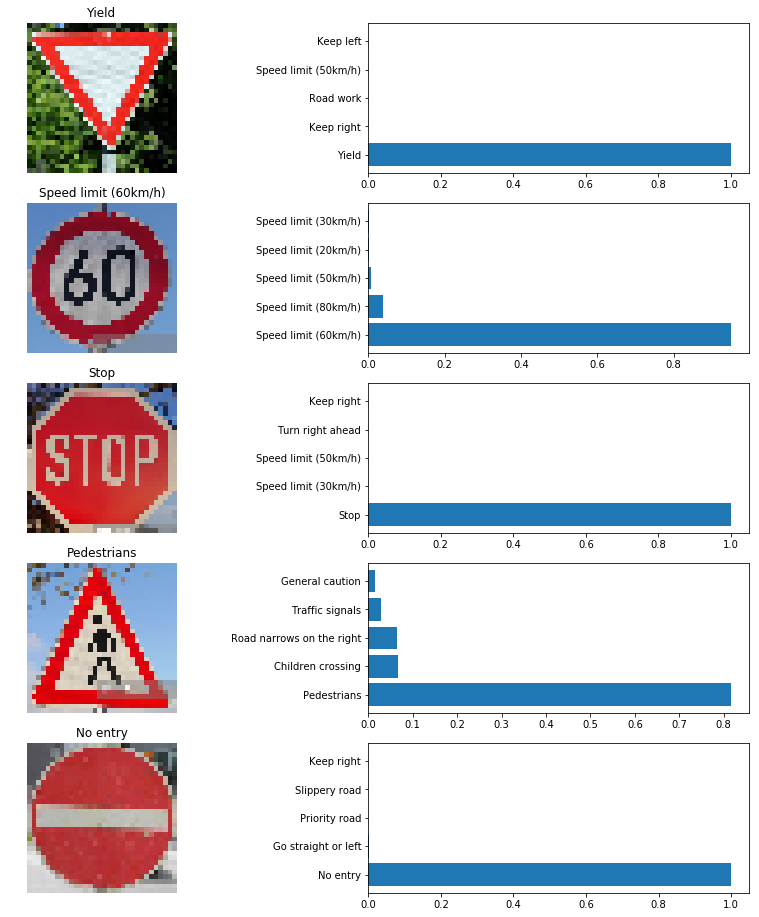
 <figcaption>
 <p></p> 
 </figcaption>
</figure>

As we can notice from the top 5 softmax probabilities, the model has very high confidence (100%) when it comes to predict simple signs, like the "Stop" and the "No entry" sign, and even high confidence when predicting simple triangular signs in a very clear image, like the "Yield" sign.

On the other hand, the model's confidence slightly reduces with more complex triangular sign in a "pretty noisy" image, in the "Pedestrian" sign image, we have a triangular sign with a shape inside it, and the images copyrights adds some noise to the image, the model was able to predict the true class, but with 80% confidence.

And in the "Speed limit" sign, we can observe that the model accurately predicted that it's a "Speed limit" sign, but was somehow confused between the different speed limits. However, it predicted the true class at the end.

The VGGNet model was able to predict the right class for each of the 5 new test images. Test Accuracy = 100.0%.
In all cases, the model was very certain (80% - 100%).


---

## Conclusion

Using VGGNet, we've been able to reach a very high accuracy rate. We can observe that the models saturate after nearly 10 epochs, so we can save some computational resources and reduce the number of epochs to 10.
We can also try other preprocessing techniques to further improve the model's accuracy..
We can further improve on the model using hierarchical CNNs to first identify broader groups (like speed signs) and then have CNNs to classify finer features (such as the actual speed limit)
This model will only work on input examples where the traffic signs are centered in the middle of the image. It doesn't have the capability to detect signs in the image corners.
